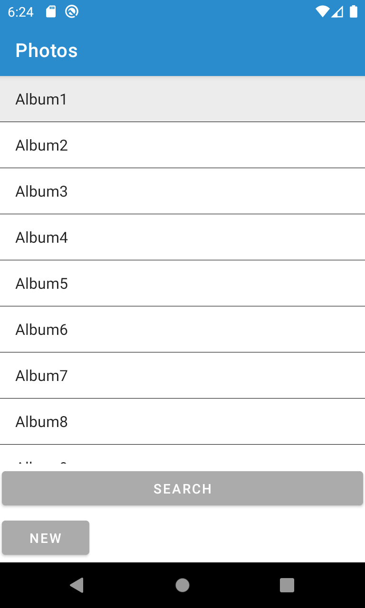
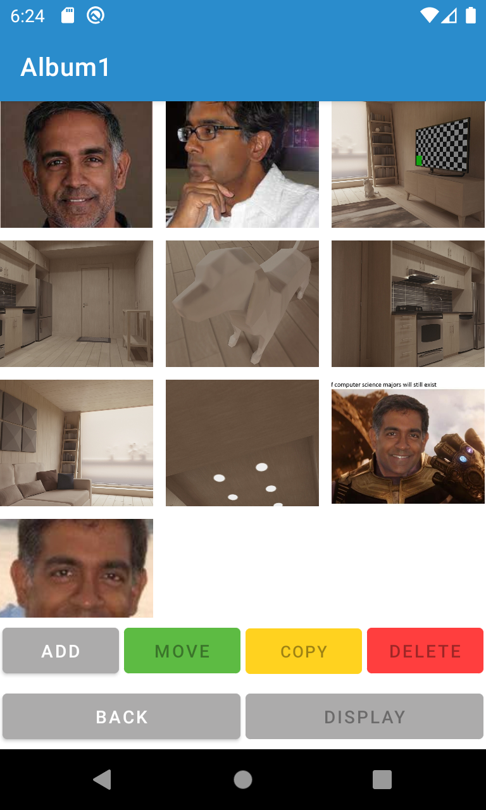
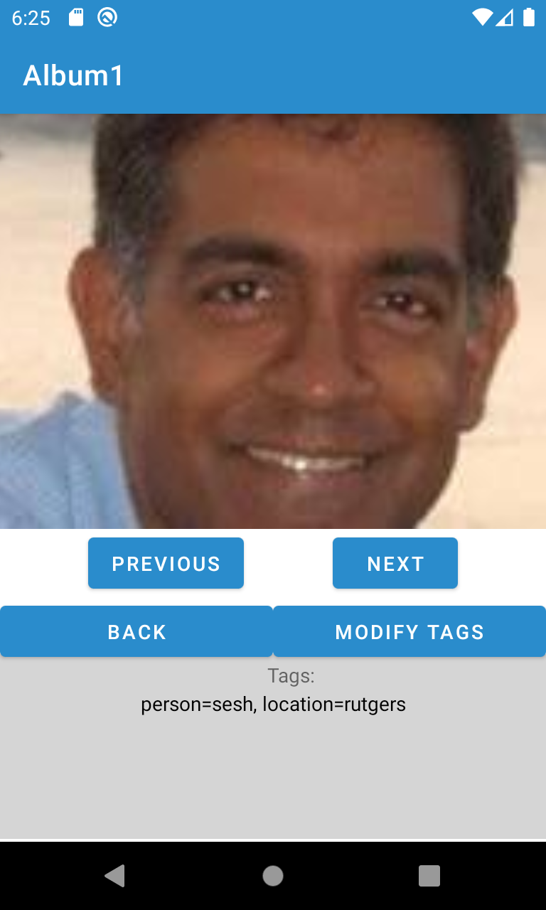
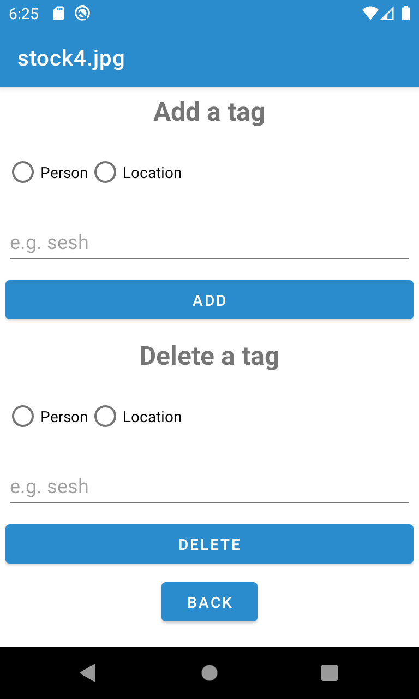
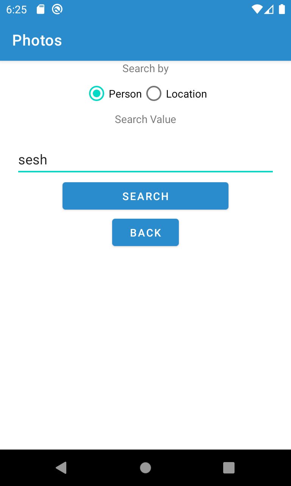
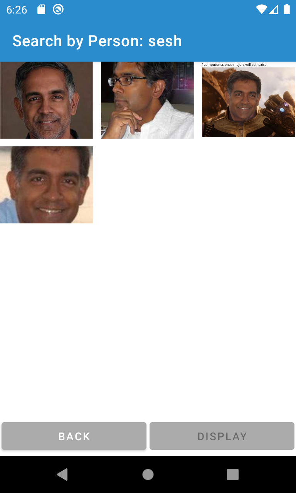

# Android_Photos

## Description
This was the fourth project for CS213 Software Methodology at Rutgers University. The goal was to create a photo album application using Android.

## Features
* Clean & responsive UI
* Add/edit/delete albums
* Add/edit/delete photos
* Move/copy photos to different albums
* Search person or location
* Data persistence using serialization
* and more!

## Local Setup
1. Clone the repository locally
2. See the setup.pdf for android studio in the "readme" folder

## Overall Contributions 

- [Zihao Zheng (Group Lead) ](https://github.com/zhengzihao2002) - 99.5%
- Yiming Huang 

For details see contributions.txt

## Gallery
Home Screen  
 
Album Details  
 
Display Photo  
 
Modify Tags  
 
Search  
 
Result from search  
 

## For Rutgers Students
Please follow both Rutgers University's [Principles of Academic Integrity](http://academicintegrity.rutgers.edu/) and the Rutgers Department of Computer Science's [Academic Integrity Policy](https://www.cs.rutgers.edu/academics/undergraduate/academic-integrity-policy)

Only use this as an guide to see what is expected in the project. Code stealing is strictly prohibited. The author's name is hidden in the code in a form that is not visible to human eye but visible to plagiarism checkers. Don't risk it.

